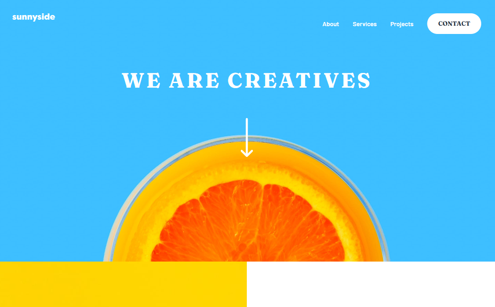

# Frontend Mentor - Sunnyside agency landing page solution

This is a solution to the [Sunnyside agency landing page challenge on Frontend Mentor](https://www.frontendmentor.io/challenges/sunnyside-agency-landing-page-7yVs3B6ef). Frontend Mentor challenges help you improve your coding skills by building realistic projects.

## Table of contents

## Table of contents

- [Overview](#overview)
  - [Screenshot](#screenshot)
  - [Links](#links)
- [My process](#my-process)
  - [Built with](#built-with)
- [Author](#author)

## Overview

Sunnyside Agency Landing Page

### Screenshot

### Links

- Solution URL: [Github](https://github.com/Ellamonacillo/sunnyside-agency-landing-page.github.io)
- Live Site URL: [Netlify](https://mgm-sunnyside-agency-landing-page.netlify.app/)

## My process

### Built with

- HTML5
- JavaScript
- React.js
- Tailwind CSS

## Author

- Website - [Mariella Monacillo](https://mariellamonacillo.netlify.app)
- Frontend Mentor - [@ellamonacillo](https://www.frontendmentor.io/profile/ellamonacillo)